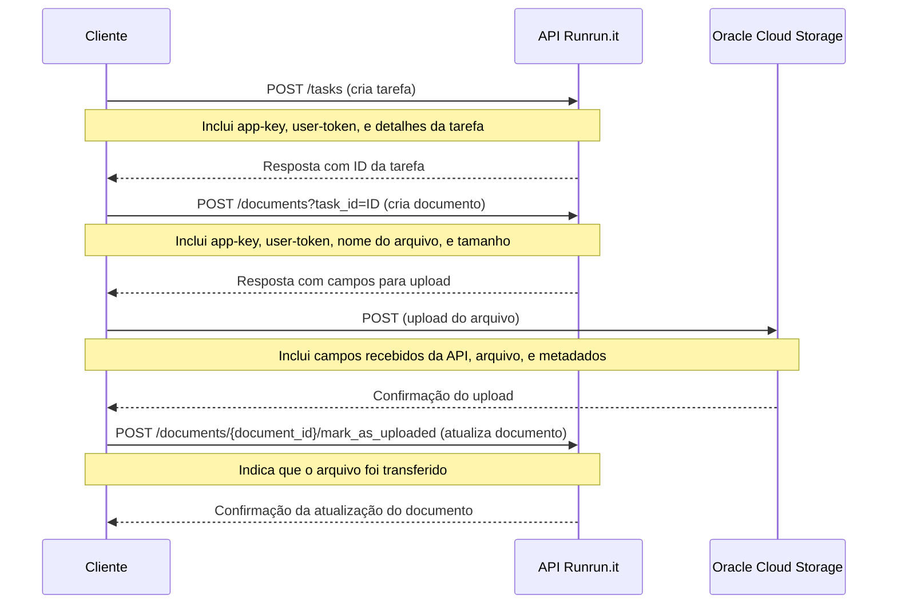

> **Changelog:** Os exemplos foram atualizados para refletir a mudança do provedor de armazenamento de arquivos, que passou do S3 (AWS) para o Oracle Cloud Storage.

# Upload de Arquivos

Para fazer upload de um arquivo no Runrun.it utilizamos a API `documents`.
O processo envolve a comunicação com o Runrun.it para adquirir credenciais de upload, o upload do arquivo para o Oracle Cloud Storage e depois a confirmação do upload.

* Somente após a confirmação do upload o arquivo irá aparecer no sistema.
* Caso a confirmação do upload não seja feita o registro será apagado depois de um tempo.
* As credenciais de upload possuem validade e deverão ser utilizadas imediatamente após geradas.

O diagrama de sequência abaixo mostra o fluxo utilizado nos exemplos.

# Como executar os exemplos

É necessário utilizar um par de APP_KEY e USER_TOKEN para fazer upload. O par abaixo são exemplos e deverão ser trocados por credenicias reais para funcionar.
É necessário também editar os exemplos e substituir o código do quadro e outros dados.
As credenciais são nominais, ou seja, o dono da credencial irá aparecer como quem fez upload do arquivo.

## PHP

`APP_KEY=f9c650c98eeb28e345e0a38a184d20cb USER_TOKEN=roBknmkPI0ALmwkRuC1q php upload_file_to_task.php`

## PYTHON

`APP_KEY=f9c650c98eeb28e345e0a38a184d20cb USER_TOKEN=roBknmkPI0ALmwkRuC1q python3 upload_file_to_task.py`

## Node.js

`npm install`

`APP_KEY=f9c650c98eeb28e345e0a38a184d20cb USER_TOKEN=roBknmkPI0ALmwkRuC1q node upload_file_to_task.js`
