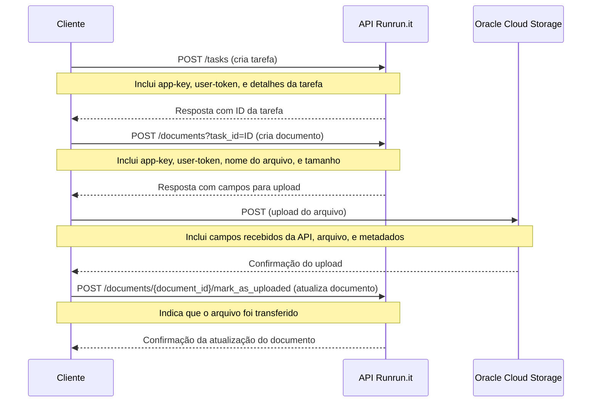

> **Changelog:** Os exemplos foram atualizados para refletir a mudança do provedor de armazenamento de arquivos, que passou do S3 (AWS) para o Oracle Cloud Storage.

# Aviso

**Este repositório contém exemplos de código e não deve ser utilizado em ambiente produtivo sem uma análise completa.**

* O código aqui apresentado tem o intuito de servir como um guia básico e inspiração para a utilização da API do Runrun.it.
* Ele não cobrirá todos os casos de uso ou cenários de erro.
* As dependências podem estar desatualizadas ou incompletas.
* O código apresentando aqui não faz parte do nosso produto e possui um ciclo de atualização, práticas e linguagens diferentes das utilizadas no nosso produto.
* Recomenda-se que qualquer implementação baseada nestes exemplos seja devidamente testada e validada por uma equipe de desenvolvimento qualificada antes de ser usada em produção.

# Upload de Arquivos

Para fazer upload de um arquivo no Runrun.it utilizamos a API `documents`.
O processo envolve a comunicação com o Runrun.it para adquirir credenciais de upload, o upload do arquivo para o Oracle Cloud Storage e depois a confirmação do upload.

* Somente após a confirmação do upload o arquivo irá aparecer no sistema.
* Caso a confirmação do upload não seja feita o registro será apagado depois de um tempo.
* As credenciais de upload possuem validade e deverão ser utilizadas imediatamente após geradas.

O diagrama de sequência abaixo mostra o fluxo utilizado nos exemplos.



# Como executar os exemplos

É necessário utilizar um par de APP_KEY e USER_TOKEN para fazer upload. O par abaixo são exemplos e deverão ser trocados por credenicias reais para funcionar.
É necessário também editar os exemplos e substituir o código do quadro e outros dados.
As credenciais são nominais, ou seja, o dono da credencial irá aparecer como quem fez upload do arquivo.

## PHP

`APP_KEY=f9c650c98eeb28e345e0a38a184d20cb USER_TOKEN=roBknmkPI0ALmwkRuC1q php upload_file_to_task.php`

## PYTHON

`APP_KEY=f9c650c98eeb28e345e0a38a184d20cb USER_TOKEN=roBknmkPI0ALmwkRuC1q python3 upload_file_to_task.py`

## Node.js

`npm install`

`APP_KEY=f9c650c98eeb28e345e0a38a184d20cb USER_TOKEN=roBknmkPI0ALmwkRuC1q node upload_file_to_task.js`

# Criar Tarefas a partir de uma Planilha

O script `create_tasks_from_spreadsheet.py` lê um arquivo Excel (`.xlsx`) e cria tarefas no Runrun.it, uma para cada linha da planilha.

## Funcionalidades

-   **Criação em Lote:** Cria múltiplas tarefas a partir de uma única planilha.
-   **Campos Padrão e Customizados:** Suporta a maioria dos campos padrão de uma tarefa (`title`, `board_id`, `project_id`, etc.) e também campos customizados.
-   **Lógica Inteligente de Campos Customizados:**
    -   O script identifica automaticamente colunas de campos customizados (ex: `custom_123`).
    -   Ele busca as definições de cada campo na API para entender o seu tipo (texto, número, data, seleção única ou múltipla).
    -   Para campos de seleção, o script busca as opções válidas e permite que você use tanto o `ID` da opção quanto o `Label` (texto da opção) na sua planilha. A correspondência do texto é case-insensitive.
    -   Validação estrita: se um valor para um campo de seleção não for encontrado, a criação da tarefa para aquela linha irá falhar com uma mensagem de erro clara.
-   **Cache de Definições:** Para melhorar a performance, as definições dos quadros e dos campos customizados são cacheadas em memória durante a execução. Um mesmo `board_id` não será consultado na API múltiplas vezes.
-   **Modo de Teste (`--dry-run`):** Permite verificar o payload que seria enviado para a API sem criar nenhuma tarefa, ideal para depuração.

## Como Executar

### 1. Dependências

Instale as bibliotecas Python necessárias:

```bash
pip install pandas openpyxl requests
```

### 2. Variáveis de Ambiente

Exporte suas credenciais da API do Runrun.it como variáveis de ambiente:

```bash
export RUNRUNIT_APP_KEY="SUA_APP_KEY"
export RUNRUNIT_USER_TOKEN="SEU_USER_TOKEN"
```

### 3. Comando de Execução

Execute o script, passando o caminho para a sua planilha Excel como argumento.

```bash
python3 create_tasks_from_spreadsheet.py "caminho/para/tarefas.xlsx"
```

**Argumentos Opcionais:**

-   `--sheet NOME_OU_INDICE`: Especifica a aba da planilha a ser lida (padrão: a primeira aba).
-   `--dry-run`: Executa o script em modo de teste, sem criar tarefas.

## Formato da Planilha

O script espera que a primeira linha da planilha seja o cabeçalho. Os nomes das colunas devem corresponder aos campos da API.

### Colunas Obrigatórias
-   `title`: O título da tarefa.
-   `board_id`: O ID do quadro onde a tarefa será criada.

### Colunas Opcionais Padrão
-   `description`: Descrição da tarefa.
-   `project_id`: ID do projeto.
-   `type_id`: ID do tipo de tarefa.
-   `assignee_id`: ID do usuário responsável (ex: `fulano-de-tal`).
-   `desired_date`: Data de entrega desejada (formatos `YYYY-MM-DD` ou data/hora ISO 8601).

### Colunas de Campos Customizados
-   Nome da coluna deve seguir o padrão `custom_ID` (ex: `custom_492`).
-   **Valores:**
    -   Para campos de texto, número ou data, insira o valor diretamente.
    -   Para campos de seleção única (`single_option`), você pode usar o `ID` da opção ou o `Label` (texto) da opção.
    -   Para campos de múltipla seleção (`multiple_options`), você pode usar uma lista de `IDs` ou `Labels`, separados por vírgula (`,`) ou ponto e vírgula (`;`).
